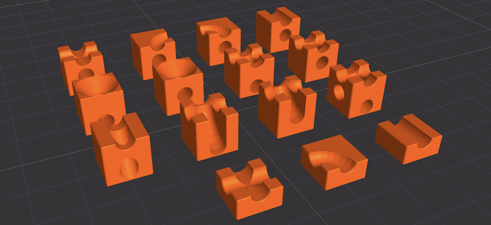

# Endless Marble Run

https://github.com/user-attachments/assets/ff9e48dc-4ef2-4600-8268-6010505a631b

This repository hosts the script and assets for the *Endless Marble Run*: a 3D simulation of modular blocks generating an infinite marble run, similar to [CUBORO™ marble run system](https://cuboro.ch), using the [p5js library](https://p5js.org/).

The collision checking is implemented from scratch and limited to sphere interaction with points. It is possible to view the collision information by setting the `debug` flag in the code to `true`.

> [!Note]  
> In some rare cases the ball may get stuck or fall off the track, in these situations the simulation has to be restarted.

One limitation is that the cubes cannot be traversed more than once, which would add excessive complexity to the code.

## Usage

Either [view the animation on GitHub pages](https://nurgak.github.io/Endless-Marble-Run/), edit the code in the [p5js editor](https://editor.p5js.org/Nurgak/sketches/ouF7jUx_3) or clone the repository and run locally.

Click on the canvas to switch between following mode and first-person-view mode.

Double-click toggles the full-screen mode.

## Assets

The assets were created using [JSCAD](https://jscad.app/). To view and edit them load the contents of `assets/boxes.js` to the JSCAD editor.

## License

This software licensed under [MIT license](LICENSE).
